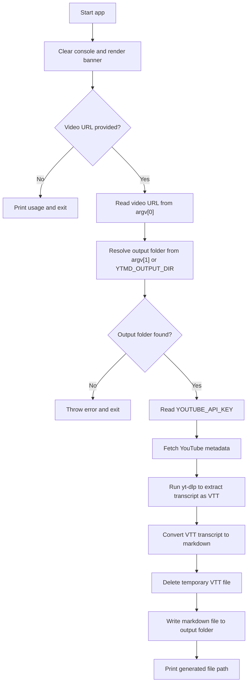

# YouTube Metadata Extractor

This is a small terminal application that does 1 thing:  grab metadata and transcripts from a YouTube video URL and puts that data into a markdown file.

That's it.

### Why did I build this?
Well, you can blame bureaucracy.  I needed the [Obsidian Web Clipper](https://obsidian.md/clipper), which does not only the same functionality as this app but more.  However, I couldn't get it approved fast enough, so I just built it myself.

Super simple to use:
- Install
- Grab yourself a YouTube API key
- Point this app to a directory (or pass a directory in the command to run)
- ???
- Markdown file


## App Flow



## App Installation and Usage

### Installation by platform

#### macOS

Use the local publish script:

```bash
bash scripts/publish-local-mac.sh
```

If `~/.local/bin` is not already on your `PATH`, add it in `zsh`:

```bash
echo 'export PATH="$HOME/.local/bin:$PATH"' >> ~/.zshrc
source ~/.zshrc
```

Run the installed command like this:

```bash
ytmd "https://www.youtube.com/watch?v=VIDEO_ID" "/Users/you/Documents/My Output"
```

#### Linux

Install or publish the app with the .NET SDK for your distro and architecture, then run the published binary from the extracted release artifact or your chosen install path:

```bash
./ytmd "https://www.youtube.com/watch?v=VIDEO_ID" "/home/you/Documents/My Output"
```

If you install the binary manually, make sure it is executable:

```bash
chmod +x ./ytmd
```

#### Windows

Extract the `.zip` release artifact or publish with the .NET SDK, then run:

```powershell
.\ytmd.exe "https://www.youtube.com/watch?v=VIDEO_ID" "C:\Users\you\Documents\My Output"
```

### Published release artifacts

Published release artifacts:

- `ytmd-osx-arm64.tar.gz`
- `ytmd-osx-x64.tar.gz`
- `ytmd-linux-x64.tar.gz`
- `ytmd-win-x64.zip`

After downloading the artifact for your platform:

- macOS and Linux: extract the `.tar.gz`, make sure `ytmd` is executable, and run:

```bash
./ytmd "https://www.youtube.com/watch?v=VIDEO_ID" "/path/to/output"
```

- Windows: extract the `.zip` and run:

```powershell
.\ytmd.exe "https://www.youtube.com/watch?v=VIDEO_ID" "C:\path\to\output"
```

- Release artifacts include the .NET app only. `yt-dlp` must still be installed separately.
- `YOUTUBE_API_KEY` must still be configured in the environment before running the tool.

### Cross-platform runtime requirements

### Supported platforms

- `macOS`, `Windows`, and `Linux` are all reasonable target platforms for this console app because it is built on `.NET`.
- The app itself is portable, but shell setup, environment variable configuration, executable names, and external tool installation vary by OS.

### Required dependencies

- `.NET SDK` or runtime compatible with the project target framework: `net10.0`.
- A YouTube Data API key in the `YOUTUBE_API_KEY` environment variable.
- `yt-dlp` installed separately and available on `PATH`.
- `ffmpeg` is not required for the current transcript-only flow, but it may become useful later if audio or video processing is added.

### YouTube API key setup

Set the API key in your shell before running the app.

macOS or Linux (`bash` or `zsh`):

```bash
export YOUTUBE_API_KEY="your-api-key-here"
ytmd "https://www.youtube.com/watch?v=VIDEO_ID"
```

Windows PowerShell:

```powershell
$env:YOUTUBE_API_KEY = "your-api-key-here"
ytmd -- "https://www.youtube.com/watch?v=VIDEO_ID"
```

Windows persistent setup with `setx`:

```powershell
setx YOUTUBE_API_KEY "your-api-key-here"
```

- After `setx`, open a new terminal before running the app.
- Do not commit API keys to source control or store them in tracked files.

### `yt-dlp` considerations

- `yt-dlp` must be installed separately unless the project later bundles it.
- The current code starts `yt-dlp` by name, so it must be resolvable on `PATH` or transcript extraction will fail.
- On Windows, the executable may be `yt-dlp.exe`, but it still needs to be reachable from `PATH`.
- Transcript availability is not guaranteed for every video. It depends on caption availability and YouTube behavior at runtime.

### Certificates and network behavior

- The current transcript flow runs `yt-dlp` with browser impersonation enabled.
- Some VPNs, proxies, corporate endpoint tools, or TLS-inspecting networks can cause certificate validation or connection failures in that flow.
- Insecure certificate bypasses should be treated as local troubleshooting only, not as the recommended default operating mode.
- If you are behind a TLS-inspecting proxy, the correct long-term fix is to configure the OS trust store or CA bundle properly.

### Paths and shell quoting

- Quote paths and URLs that contain spaces when passing them on the command line.
- The app uses platform-safe path handling internally with `Path.Combine`, but the shell still requires correct quoting for input values.

macOS or Linux:

```bash
ytmd "https://www.youtube.com/watch?v=VIDEO_ID" "/Users/you/Documents/My Output"
```

Windows PowerShell:

```powershell
ytmd -- "https://www.youtube.com/watch?v=VIDEO_ID" "C:\Users\you\Documents\My Output"
```

- The current implementation reads the output folder from the second positional argument.
- The printed usage text mentions `--out`, but the present code does not parse `--out` as a named option.
- If neither an output folder argument nor `YTMD_OUTPUT_DIR` is provided, the app errors instead of falling back to a default output folder.

### Temporary files and output files

- VTT transcript files are scratch files written under a local `temp` directory during transcript extraction.
- The app attempts to delete the temporary `.vtt` file after processing, so the temp folder should not be treated as final output.
- Markdown output is written to the output folder passed as the second argument.
- If no output folder is provided and `YTMD_OUTPUT_DIR` is unset, the app stops with a clear error instead of using a default folder.

### Windows-specific notes

- Markdown filenames should avoid invalid Windows filename characters and reserved names. The current code sanitizes invalid filename characters before writing the output file.
- Console colors and spinner rendering will usually look best in Windows Terminal or a modern PowerShell host.

### Linux-specific notes

- File paths are case-sensitive on most Linux systems.
- If `yt-dlp` was installed manually, ensure it has execute permission.
- The app creates its output directory when needed, but the parent location still must be writable by the current user.

## Releases and versioning

GitHub Releases are built automatically from `main` using `semantic-release` and Conventional Commits.

- Initial release seed:

```bash
git tag v0.0.1
git push origin v0.0.1
```

- Version bump rules:
  - `fix:` creates a patch release
  - `feat:` creates a minor release
  - `BREAKING CHANGE:` or `feat!:` creates a major release
  - `chore:`, `docs:`, `ci:`, `style:`, `refactor:`, and `test:` do not create a release by default

Example commit messages:

```text
fix: handle missing transcript file cleanly
feat: add linux release packaging
feat!: change command-line argument parsing
```

---

## Credits
- Spectre.Console: [`Spectre.Console`](https://spectreconsole.net/)
- Figgle (ASCII Art): [`Figgle`](https://github.com/drewnoakes/figgle)

---

## License

This is free and unencumbered software released into the public domain.

See the [LICENSE](LICENSE) file or <https://unlicense.org/> for details.

SPDX-License-Identifier: Unlicense


